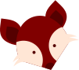
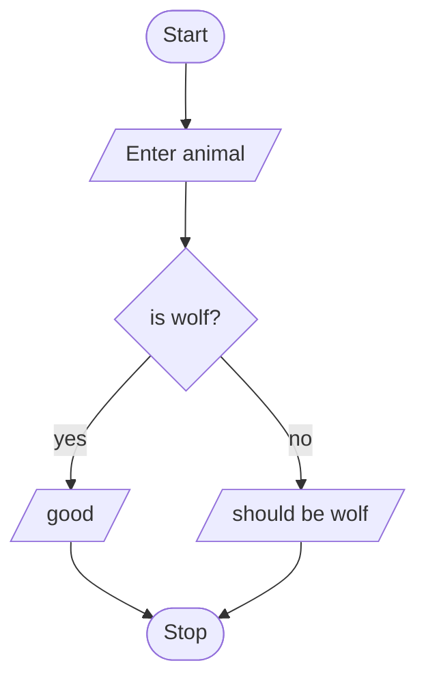
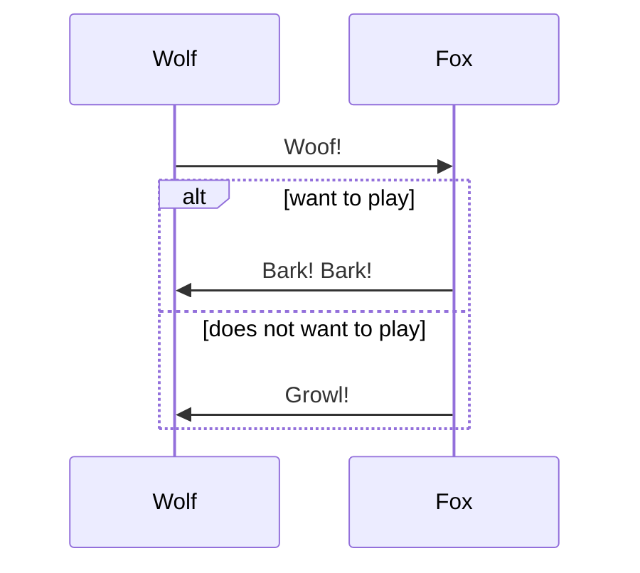
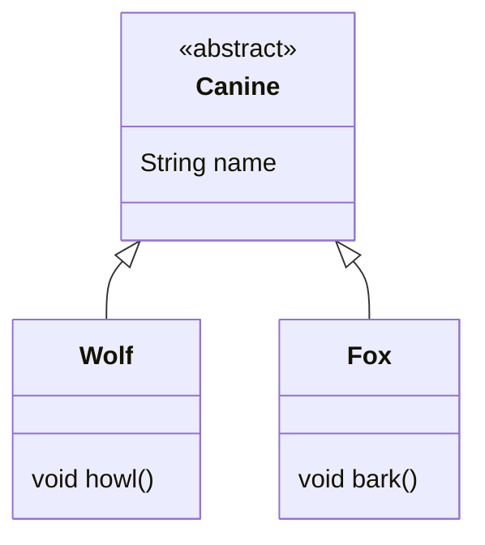
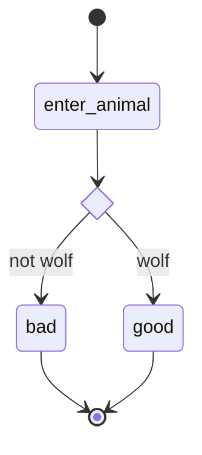
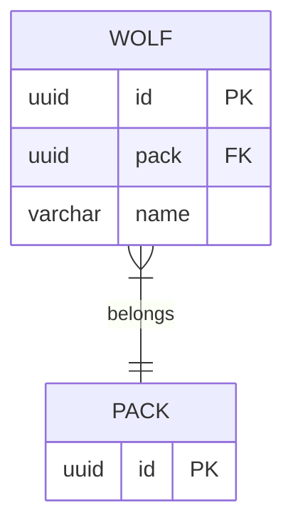
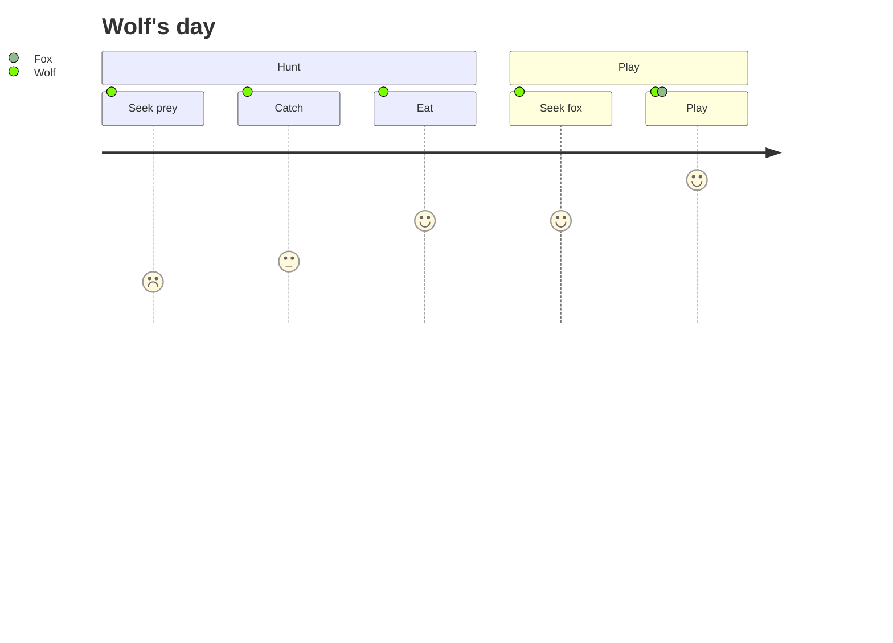
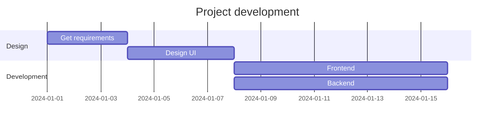
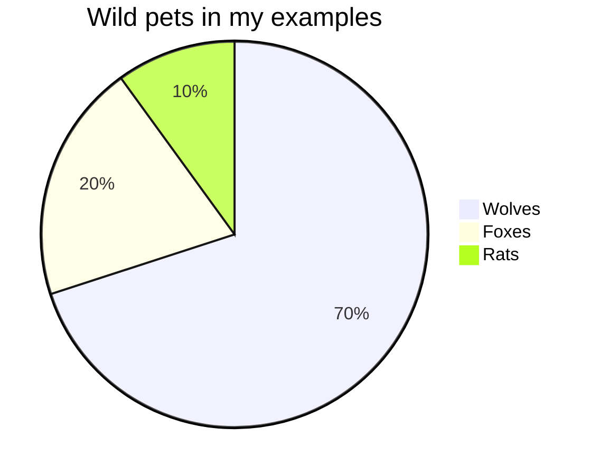

# Examples

## Slides Examples

Michał Wójcik

---

### Motivation

Why don't want to use WYSIWYG:

* developer most time are dealing with editing sorce codes and navigating between them,
* as far as point and click games are loved, this approach at work is not ergonomic,
* batch updating is at least painful,
* moving/copying content between topics or courses is troublesome,
* sharing content in other forms than slides is impossible without maintaining separate files with the same content.

---

### Markdown

Why use markdown:

* when creating academic slides, fancy animations are not required, this is not advertisement,
* it's simple text format,
* way simpler than LaTeX (bullet list for example),
* slides content can be separated from slides styling and published independently,
* developer platforms (like GitLab) support it and render nice HTML.

---

### Flow

What's the flow:

* select best suited JavaScript presentation engine,
* create HTML+CSS+JS project,
* create HTML+CSS templates,
* fix the engine as it does not meet particular whim,
* implement slides serving logic,
* configure simple HTTP server,
* create HTML to PDF converting script,
* create slides:
  * start HTTP server,
  * display preview in browser,
  * add markdown file for course or topic,
  * add CSS styles if some additional styling is needed,
  * generate PDF.

---

### Title slide

The title slide should have the following format.

```md
# Course name

## Topic

Author
```

---

### Subsequent slides

Subsequent slides can have any content.

```md
### Subsequent slides

Subsequent slides can have any content.
```

---

### Separating slides

Slides are separated with `---`.

```md
# Course name

## Topic

Author

---

### Subsequent slides

Subsequent slides can have any content.
```

---

### Just text

The text may be **bold** or written in *italics* or ***both***.

It may also be in several paragraphs.

```markdown
### Just text

The text may be **bold** or written in *italics* or ***both***.

It may also be in several paragraphs.
```

---

### Table

Tables are made simply.

| Header          | Header        |
|-----------------|---------------|
| entry           | entry         |
| even more entry | another entry |

```markdown
### Table

Tables are made simply.

| Header          | Header        |
|-----------------|---------------|
| entry           | entry         |
| even more entry | another entry |
```

---

### Images

Images (also vectors) are embedded as links with `!`.



```markdown
### Images

Images (also vectors) are embedded as links with `!`.


```

---

### Diagrams

Diagrams can be implemented using the mermaid library.

---

### Diagrams - flowchart



````markdown

````

---

### Diagrams - sequence



````markdown

````

---

### Diagrams - class



````markdown

````

---

### Diagrams - state



````markdown

````

---

### Diagrams - ERD



````markdown

````

---

### Diagrams - journey



````markdown

````

---

### Diagrams - Gantt



````markdown

````

---

### Diagrams - pie chart



````markdown

````

---

### Source code

The source code is placed in ` ``` ` specifying the language name.

```java
public class Main {
    public static void main(String[] args) {

    }
}
```

````markdown
The source code is placed in ` ``` ` specifying the language name.

```java
public class Main {
    public static void main(String[] args) {

    }
}
```
````

---

### Styling

Styling slides for PDF generation can be done with CSS.

---

### Styling - floating images

```css
[data-title="Diagrams - flowchart"] div.mermaid,
[data-title="Diagrams - sequence"] div.mermaid,
[data-title="Diagrams - class"] div.mermaid,
[data-title="Diagrams - state"] div.mermaid,
[data-title="Diagrams - ERD"] div.mermaid {
    float: left;
    width: 45%;
    margin-right: 5%;
}
```

---

### Styling - two columns list

Two (or more) columns lists are often used for comparison.

Example pets:

* Wolves:
  * gray,
  * can be deadly.
* Foxes:
  * red,
  * can be harmless.

```markdown
Example pets:

* Wolves:
  * gray,
  * can be deadly.
* Foxes:
  * red,
  * can be harmless.
```

```css
[data-title="Styling - two columns list"] p + ul {
    display: flex;
    justify-content: space-between;
}

[data-title="Styling - two columns list"] p + ul > li {
    width: 45%;
}
```

---

### Styling - image styling

Images can be styled using image `alt` selector.


The Fox.

```markdown


The Fox.
```

```css
[data-title="Styling - image styling"] img[alt="Fox"] {
  width: 25%;
  margin: auto;
  display: block;
}

[data-title="Styling - image styling"] p:has(img) + p {
  text-align: center;
}
```

---

### Instructions

Firstly, clone this repository:

```bash
git clone https://git.pg.edu.pl/p650304/slides-ui/
```

Then you probably want to add own origin and push it to own git repository.

Start server:

```bash
npm run serve
```

Create course in `src/slides/<course_name>/<course_name>.md`.

Create topic in `src/slides/<course_name>/<topic_name>/<topic_name>.md`.

Create CSS styles in `src/css/slides/<course_name>/<topic_name>/styles.css`, if needed.

Based on examples in `src/slides/Examples` and `src/css/slides/Examples` create own content.

Generate PDF documents:

```bash
bash generate_pdf.sh
```

---

### Helpful resources

Helpful resources:

* <https://www.markdownguide.org/>
* <https://mermaid.js.org/intro/>
* <https://remarkjs.com/>

```markdown
Helpful resources:

* <https://www.markdownguide.org/>
* <https://mermaid.js.org/intro/>
* <https://remarkjs.com/>
```
